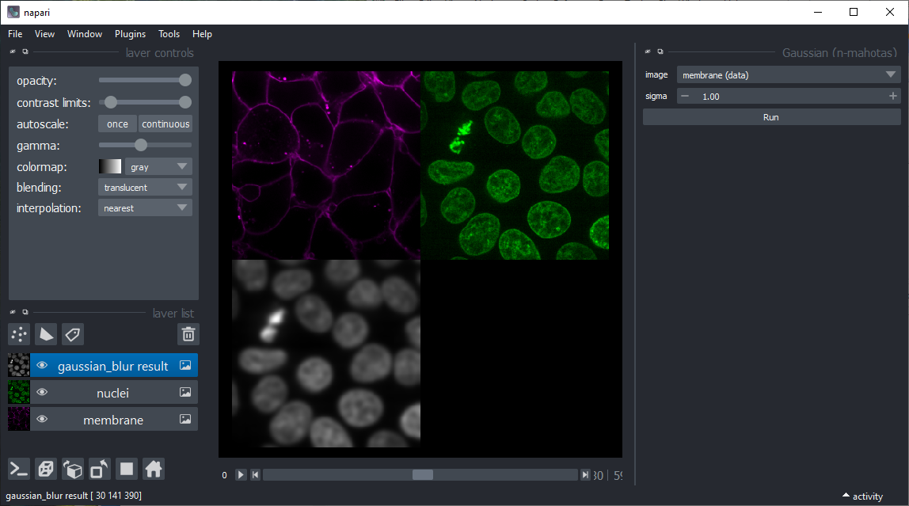
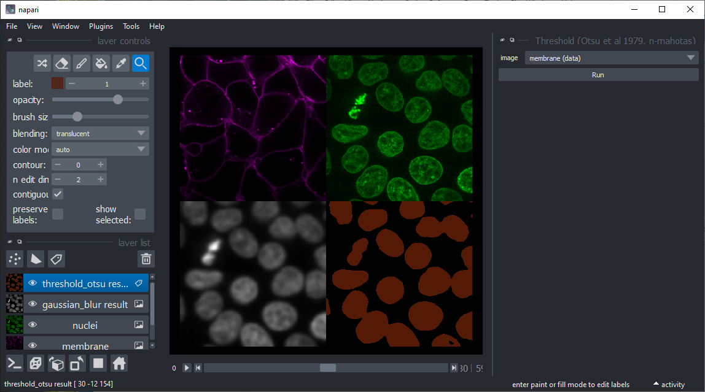
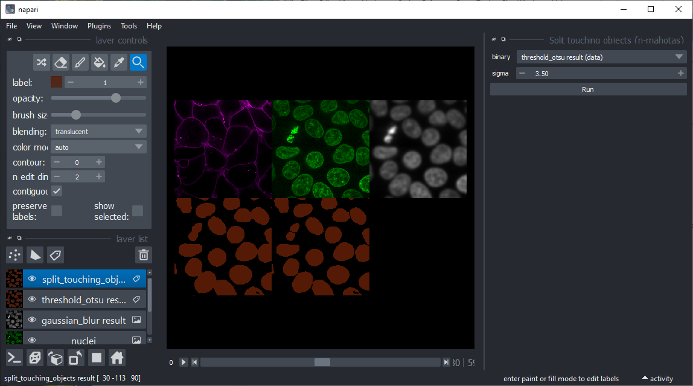
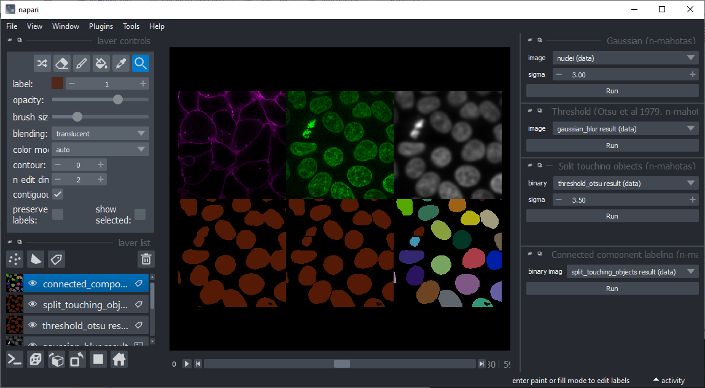
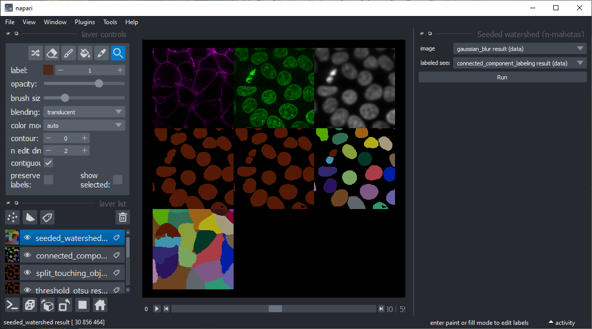

# napari-mahotas-image-processing (n-mahotas)

[](https://github.com/haesleinhuepf/napari-mahotas-image-processing/raw/main/LICENSE)
[](https://pypi.org/project/napari-mahotas-image-processing)
[](https://python.org)
[](https://github.com/haesleinhuepf/napari-mahotas-image-processing/actions)
[](https://codecov.io/gh/haesleinhuepf/napari-mahotas-image-processing)
[](https://napari-hub.org/plugins/napari-mahotas-image-processing)

Image processing based using the [Mahotas library](https://github.com/luispedro/mahotas) in [napari](https://napari.org)

## Usage


### Gaussian blur

Applies a [Gaussian blur](https://mahotas.readthedocs.io/en/latest/api.html#mahotas.gaussian_filter) to an
image. This might be useful for denoising, e.g. before applying the Threshold-Otsu method.



### Otsu's threshold

Binarizes an image using [scikit-image's threshold Otsu algorithm](https://mahotas.readthedocs.io/en/latest/api.html#mahotas.otsu), also known as 
[Otsu's method](https://ieeexplore.ieee.org/document/4310076).



### Split connected objects

In case objects stick together after thresholding, this tool might help.
It aims to deliver similar results as [ImageJ's watershed implementation](https://imagej.nih.gov/ij/docs/menus/process.html#watershed).



### Connected component labeling

Takes a binary image and produces a label image with all separated objects labeled differently. Under the hood, it uses
[mahotas' label function](https://mahotas.readthedocs.io/en/latest/api.html#mahotas.label).



### Seeded watershed

Starting from an image showing high-intensity membranes and a seed-image where objects have been labeled,
objects are labeled that are constrained by the membranes. Hint: you may want to blur the membrane channel a bit in advance.




----------------------------------

This [napari] plugin was generated with [Cookiecutter] using [@napari]'s [cookiecutter-napari-plugin] template.

## Installation

Before installing this napari plugin, please [install `mahotas`](https://github.com/luispedro/mahotas#install), e.g. using conda:

```
conda config --add channels conda-forge
conda install mahotas
```

Afterwards, you can install `napari-mahotas-image-processing` via [pip]:

    pip install napari-mahotas-image-processing


To install latest development version :

    pip install git+https://github.com/haesleinhuepf/napari-mahotas-image-processing.git


## Contributing

Contributions are very welcome. Tests can be run with [tox], please ensure
the coverage at least stays the same before you submit a pull request.

## License

Distributed under the terms of the [BSD-3] license,
"napari-mahotas-image-processing" is free and open source software

## Issues

If you encounter any problems, please [file an issue] along with a detailed description.

[napari]: https://github.com/napari/napari
[Cookiecutter]: https://github.com/audreyr/cookiecutter
[@napari]: https://github.com/napari
[MIT]: http://opensource.org/licenses/MIT
[BSD-3]: http://opensource.org/licenses/BSD-3-Clause
[GNU GPL v3.0]: http://www.gnu.org/licenses/gpl-3.0.txt
[GNU LGPL v3.0]: http://www.gnu.org/licenses/lgpl-3.0.txt
[Apache Software License 2.0]: http://www.apache.org/licenses/LICENSE-2.0
[Mozilla Public License 2.0]: https://www.mozilla.org/media/MPL/2.0/index.txt
[cookiecutter-napari-plugin]: https://github.com/napari/cookiecutter-napari-plugin

[file an issue]: https://github.com/haesleinhuepf/napari-mahotas-image-processing/issues

[napari]: https://github.com/napari/napari
[tox]: https://tox.readthedocs.io/en/latest/
[pip]: https://pypi.org/project/pip/
[PyPI]: https://pypi.org/
